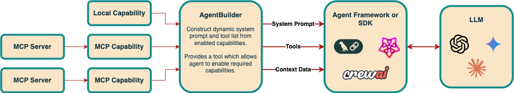

# Agent Builder

Easily create self-evolving AI agents that can choose what capabilities they need to dynamically update their instructions, context data and tools. 

The two basic concepts involved are:
- **Capability** - Consists of a collection of associated tools and context data, along with instructions and examples for how to use them. 
- **AgentBuilder** - Translates a role and list of capabilities into an aggregated dynamically evolving [system prompt](src/dev_ai/prompt_template.md) and set of tools that can be used to define an AI agent's behaviour. 

Capabilities can either be initially enabled, or a tool is provided which allows the agent to enable capabilities as required. 

MCP-based capabilities enable super-simple and flexible integration of one or many MCP servers with your agent. All the complexity of MCP session lifecycle management, communication, tool calling, resource retrieval and server notification handling is taken care of automatically.  

Works alongside your favourite agent framework, or greatly simplifies the process of building powerful AI agents directly with a model provider's SDK or API. 



## Usage & Examples

### Defining and using AgentBuilder

```py
import os
from dev_ai.agent_builder import AgentBuilder
from dev_ai.capabilities import FileSystemCapability, StdioMCPCapability

ROLE = """You are a helpful assistant with strong software development and engineering skills,
whose purpose is to help the user with their software development or general computer use needs."""

agent_builder = AgentBuilder(
    role=ROLE,
    capabilities=[
        FileSystemCapability(),
        StdioMCPCapability(
            name="github_integration",
            description="Manage GitHub repositories, enabling file operations, search functionality, and integration with the GitHub API for seamless collaborative software development.",
            command="npx",
            args=["-y", "@modelcontextprotocol/server-github"],
            env={"GITHUB_PERSONAL_ACCESS_TOKEN": os.getenv("GITHUB_ACCESS_TOKEN", "")},
            tools=["search_repositories", "read_file", "search_code"],
        ),
    ],
)
tools = await agent_builder.get_tools()
system_prompt = await agent_builder.get_system_prompt()
```

### Using with OpenAI SDK
Includes an `OpenAITools` helper class to translate tools to OpenAI SDK format and handle tool execution. 
```py
from openai import AsyncOpenAI
from openai.types.responses import EasyInputMessageParam

from dev_ai.compat.openai import OpenAITools
from examples.agent_builder import get_agent_builder

async def run_openai(prompt: str, model_name: str, api_key: str):
    client = AsyncOpenAI(api_key=api_key)

    async with get_agent_builder() as agent_builder:
        message_history = [EasyInputMessageParam(role="user", content=prompt)]
        # Agent tool calling loop
        while True:
            # Retrieve tools within loop so they can be dynamically updated
            tools = await agent_builder.get_tools()
            openai_tools = OpenAITools(tools)

            response = await client.responses.create(
                model=model_name,
                input=[EasyInputMessageParam(role="system", content=await agent_builder.get_system_prompt())]
                + message_history,
                tools=openai_tools.get_tool_params(),
            )

            output = response.output[0]
            if output.type == "function_call":
                # Call the tool
                result = await openai_tools.handle_function_call_output(output)
                # Add the tool response to the message history
                message_history.append(output)
                message_history.append(result)
            else:
                print(f"AI Agent: {response.output_text}")
                break
```
[See code here.](src/examples/openai/run.py)

### Using with LangChain/LangGraph
The prebuilt `create_react_agent()` does not support dynamic updating of tools within a run, so `interrupt_after` is used as a workaround to achieve this. 
It would be possible to create a custom graph-based agent that supports this more natively. 
```py
from langchain_core.messages import HumanMessage, ToolMessage
from langchain_google_genai import ChatGoogleGenerativeAI
from langgraph.prebuilt import create_react_agent

from dev_ai.compat.langchain import tool_to_langchain_tool
from examples.agent_builder import get_agent_builder


async def run_langchain(prompt: str, model_name: str, api_key: str):
    model = ChatGoogleGenerativeAI(model=model_name, google_api_key=api_key)

    async with get_agent_builder() as builder:
        messages = [HumanMessage(content=prompt)]

        while True:
            agent = create_react_agent(
                model,
                tools=[tool_to_langchain_tool(tool) for tool in await builder.get_tools()],
                prompt=await builder.get_system_prompt(),
                # Interrupt after tool calls to dynamically rebuild agent with new tools and system prompt
                interrupt_after=["tools"],
            )
            response = await agent.ainvoke({"messages": messages})

            if isinstance(response["messages"][-1], ToolMessage):
                messages = response["messages"]
                # Continue agent tool calling loop
                continue
            else:
                message = response["messages"][-1].content
                print(f"AI Agent: {message}")
                break
```
[See code here.](src/examples/langchain/run.py)

### Using with PydanticAI
The `get_pydantic_ai_tools()` helper function uses PydanticAI's [dynamic function tools](https://ai.pydantic.dev/tools/#tool-prepare) feature, 
however requires all tool definitions to be built up-front, meaning MCP servers & sessions for all MCP capabilities will need to be initialised even if they are not enabled.  
A custom wrapper is also added to the tools which causes the system prompt to be dynamically updated within an agent run.
```py
from pydantic_ai import Agent

from dev_ai.compat.pydantic_ai import get_pydantic_ai_tools
from examples.agent_builder import get_agent_builder

from .llm import build_model_from_name_and_api_key


async def run_pydantic_ai(prompt: str, model_name: str | None, api_key: str | None = None):
    # Build the model from name and API key
    model = build_model_from_name_and_api_key(model_name, api_key)

    async with get_agent_builder() as builder:
        agent = Agent(model=model, tools=await get_pydantic_ai_tools(builder), instrument=True)

        # Configure the dynamic system prompt (evaluated for each new agent.run(), but not within it)
        @agent.system_prompt(dynamic=True)
        async def system_prompt() -> str:
            return await builder.get_system_prompt()

        response = await agent.run(prompt)

        print(f"AI Agent: {response.output}")
```
[See code here.](src/examples/pydantic_ai/run.py)

## Features

### General
- Fully async and typed
- Customizable [system prompt template](src/dev_ai/prompt_template.md)
- Helpful utilities for compatibility with LangGraph & PydanticAI frameworks and OpenAI SDK
- Auto-create tools from existing sync or async functions/methods.
- Built-in Filesystem capability with dynamically updating directory tree context data


### MCP Capabilities
- Add description, instructions and usage examples for how to use the MCP server
- Choose which tools to include
- Automatically include specified resources in system prompt context data
- Advanced MCP session lifecycle management that allows MCP servers to be initialised on-demand only when they are enabled. 
- Handle server sampling requests (so MCP server can make request to LLM/agent)
- Automatic caching of tool and resource lists, with handling of server notifications to reset caches (not even officially supported by the MCP SDK yet)
- Easily customize the behaviour of MCP tools / resources and how they are presented to the agent (see Customise MCP Capabilities)

## Installation

Instructions on how to install and set up your project.


### Customise MCP Capabilities

You can create custom `StdioMCPCapability` or `HttpMCPCapability` subclasses for a specific MCP server to do things like:
- Customize the behaviour of specific tools, by defining a tool that wraps one or more MCP server tools with arbitrary logic
- Create a hybrid capability which has a mix of MCP and non-MCP tools (and resources)


## Future Work

### General
- More logging / observability 

### MCP Capability
- Subscribe to resources for automatic dynamic updates and smart caching
- Dynamic / Templated resources
- MCP prompts
- Tool to allow agent to read resources


## License


